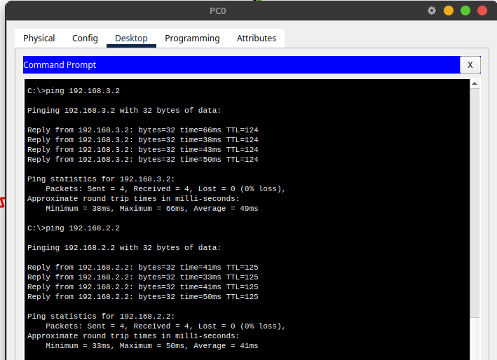

## Router 0 OSPF configiration:
```shell
conf t
interface Serial0/1/0
 ip address 192.168.6.10 255.255.255.0
 no shutdown
interface Serial0/1/1
 ip address 192.168.8.10 255.255.255.0
 no shutdown
interface GigabitEthernet0/0/0
 ip address 192.168.2.10 255.255.255.0
 no shutdown
router ospf 1
 network 192.168.6.0 0.0.0.255 area 0
 network 192.168.8.0 0.0.0.255 area 0
 network 192.168.2.0 0.0.0.255 area 0
end
```

## The ping between machine from (from PC0 to others) 


## the path taken for an exchange between PC0 and PC1
- from PC 2 to PC 1
```shell
C:\>tracert 192.168.1.2

Tracing route to 192.168.1.2 over a maximum of 30 hops: 

  1   0 ms      0 ms      10 ms     192.168.2.10
  2   1 ms      1 ms      0 ms      192.168.6.1
  3   *         *         *         Request timed out.
  4   1 ms      1 ms      1 ms      192.168.1.2

Trace complete.
```
- from PC 1 to PC 2
```shell
C:\>tracert 192.168.2.2

Tracing route to 192.168.2.2 over a maximum of 30 hops: 

  1   0 ms      0 ms      0 ms      192.168.1.3
  2   *         *         *         Request timed out.
  3   1 ms      1 ms      1 ms      192.168.6.10
  4   28 ms     0 ms      1 ms      192.168.2.2

Trace complete.
```